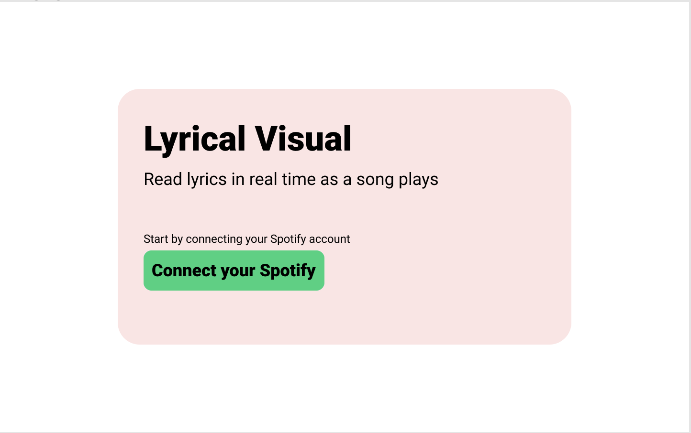
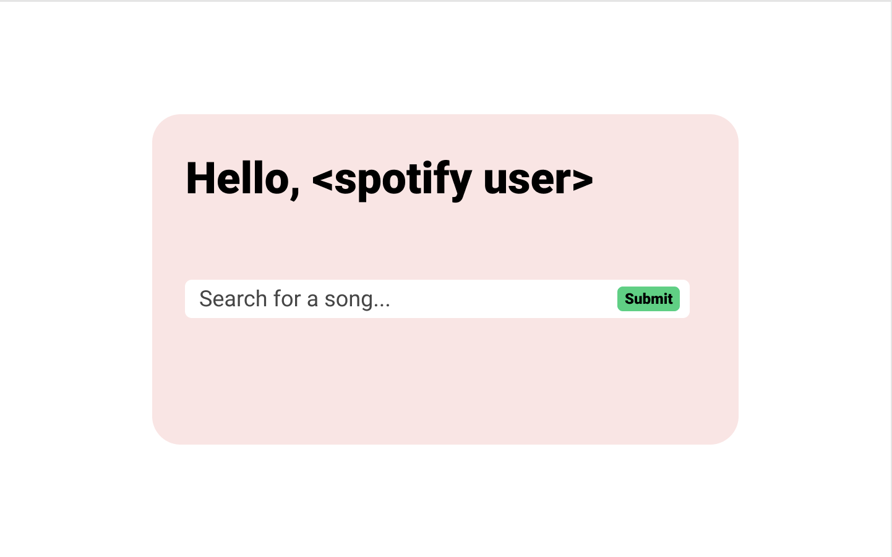
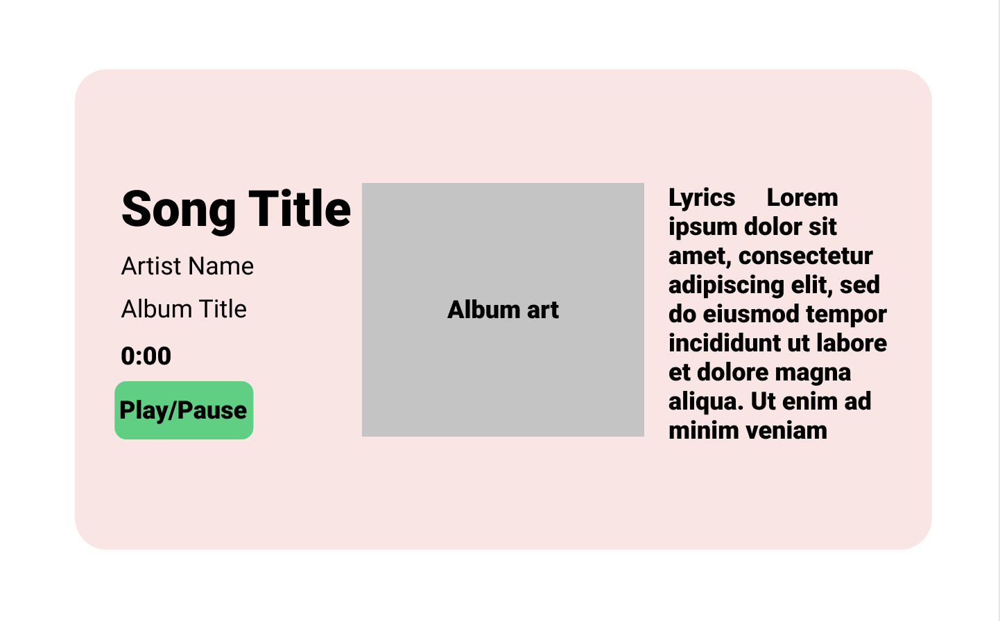

# Lyrical Visual

## Live version

## Objective: 
Listening to a song by itself and listening to it while reading the lyrics are two different things. Spotify as of right now does not have a feature to display real time lyrics of a song being played. Lyrical Visual is meant to facilitate that capability in a cool way. 

## Inspiration 
Instagram has a feature where users can search a song on spotify and then display the songs along with the song playing. Though this only lasts 15 seconds max.

## Wireframes 
### Landing Page

### Song Seach Page

### Player page

## User Persona:

Steven, casual listener
Early 20s 
Casual listener
Mostly knows lyrics of songs just by listening to them

Jason, active listener
Mid 20s 
Active listener
Searches for a complete transcript of a song’s lyrics in order to fully take in the song 

## Timeline: 

### Phase 1: 

- Draw up wireframes 
- Build basic node app with express server and handlebars 
- set up Dockerfile
- Push to live hosting

### Phase 2:

Implement spotify API
Implement spotify authorization 
Install 3rd party spotify node modules 
Connect user to spotify account 
Be able to search and play song
Push to live hosting 

### Phase 3:

Display lyrics real time as song plays 
Polish frontend 
Push to live hosting
Technical Requirements
Frontend will be built using a templating engine 
Backend will be built using node 

